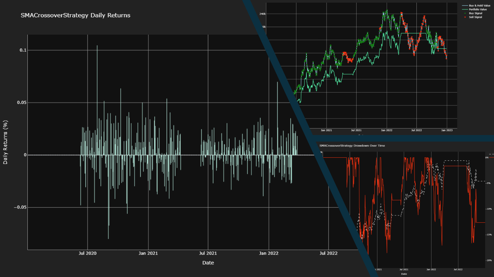

[![Contributors][contributors-shield]][contributors-url]
[![Forks][forks-shield]][forks-url]
[![Stargazers][stars-shield]][stars-url]
[![Issues][issues-shield]][issues-url]
[![MIT License][license-shield]][license-url]
[![LinkedIn][linkedin-shield]][linkedin-url]

# 📈 Quant Trading Backtesting Engine

A simple, extensible Python backtesting engine for evaluating trading strategies on historical market data.

**Screenshots** from the output can be seen below:



## 📑 Table of Contents

- [🧑‍💻 Tech Stack](#-tech-stack)
- [📖 Background: What is Backtesting?](#-background-what-is-backtesting)
- [📊 Strategies Currently Supported](#-strategies-currently-supported)
- [📝 Configuration File](#-configuration-file)
- [📝 Results](#-results)
- [📦 Getting Started](#-getting-started)
  - [🔧 Installation](#-installation)
  - [✅ Running Tests](#-running-tests)
  - [🚀 Running the App Locally](#-running-the-app-locally)
- [👭🏻 Contributing](#-contributing)
  - [🧩 Adding Dependencies](#-adding-dependencies)
  - [🧪 Adding Dev Dependencies](#-adding-dev-dependencies)
- [📬 Contact](#-contact)


## 🧑‍💻 Tech Stack

![Python]
![Pandas]
![NumPy]
![Plotly]


## 📖 Background: What is Backtesting?

**Backtesting** is the process of evaluating a trading strategy using historical price data to simulate how it would have performed in the past. It helps quantify the effectiveness, risk, and robustness of an strategy before deploying it with real capital.

By simulating trades over time, backtesting allows quants and traders to:
- Validate strategy logic (e.g. moving average crossover, momentum, mean reversion)
- Estimate historical returns, drawdowns, and volatility
- Compare strategies using objective metrics like Sharpe Ratio or Win Rate
- Test the impact of transaction costs and slippage
- Avoid overfitting through walk-forward analysis or out-of-sample testing


## 📊 Strategies Currently Supported

- Buy & Hold
- Mean Reversion
- Momentum
- SMA Crossover


## 📝 Configuration File

A **JSON** config file is the only imput required for the backtesting engine. It defines a batch of simulations under a `simGroup`, with global settings like `outputDirLocation` and `author`. Each simulation in the sims array includes a unique `simId`, a `strategy` with its parameters, data source details (e.g. ticker, date range), and a `simConfig` block for initial cash, slippage, and commission. This structure allows easy setup and parallel execution of multiple strategy runs via multiprocessing.

Simulations are defined in a single **JSON** file with the following structure:

```json
{
    "sim_group": "example_sim_group",
    "output_dir_location": "./out",
    "author": "Tom Aston",
    "sims": [
        {
            "sim_id": "001",
            "strategy": {
                "type": "SMACrossover",
                "fields": {
                    "short_window": 50,
                    "long_window": 100
                }
            },
            "data": {
                "source": "yfinance",
                "ticker": "AAPL",
                "start_date": "2020-01-02",
                "end_date": "2023-01-01",
            },
            "sim_config": {
                "initial_cash": 100000,
                "slippage": 0.01,
                "commission": 0.001
            }
        },
        {
            "sim_id": "002",
            "strategy": {
                "type": "BuyAndHold",
            },
            "data": {...},
            "sim_config": {...}
        }
    ]
}
```

## 📝 Results

The simulation results are organized by `simGroup` and `ticker` symbol. Inside each ticker folder, you’ll find all relevant files for each simulation named using the format `<simId>_<strategy>_<artifact>`.

Each simulation produces the following outputs:

- `strategy_vs_buy_and_hold` plot comparing strategy performance against buy-and-hold
- `daily_returns` plot showing daily portfolio returns
- `drawdown` plot highlighting peak-to-trough losses
- `performance_metrics.txt` summarizing key performance statistics
- `result.csv` containing detailed time series data of portfolio value and positions


```txt
out/
└── my_sim_group/
    ├── AAPL/
    │   ├── 001_SMACrossover_strategy_vs_buy_and_hold.png
    │   ├── 001_SMACrossover_daily_returns.png
    │   ├── 001_SMACrossover_drawdown.png
    │   ├── 001_SMACrossover_performance_metrics.txt
    │   ├── 001_SMACrossover_result.csv
    │   ├── 002_BuyAndHold_strategy_vs_buy_and_hold.png
    │   ├── 002_BuyAndHold_daily_returns.png
    │   ├── 002_BuyAndHold_drawdown.png
    │   ├── 002_BuyAndHold_performance_metrics.txt
    │   └── 002_BuyAndHold_result.csv
    └── MSFT/
        ├── 003_SMACrossover_strategy_vs_buy_and_hold.png
        ├── 003_SMACrossover_daily_returns.png
        ├── 003_SMACrossover_drawdown.png
        ├── 003_SMACrossover_performance_metrics.txt
        ├── 003_SMACrossover_result.csv
        ├── 004_BuyAndHold_strategy_vs_buy_and_hold.png
        ├── 004_BuyAndHold_daily_returns.png
        ├── 004_BuyAndHold_drawdown.png
        ├── 004_BuyAndHold_performance_metrics.txt
        └── 004_BuyAndHold_result.csv
```

## 📦 Getting Started

This project uses [**uv**](https://docs.astral.sh/uv/getting-started/installation/) for dependency management and virtual environments. Please ensure `uv` is installed before proceeding.

### 🔧 Installation

Set up your virtual environment and install dependencies:


💻 Windows, MacOS, or Linux

```bash
uv venv
uv sync
```

Or, if you're on MacOS or Linux, you can use the `Makefile`:

```bash
make install
```

### ✅ Running Tests

To execute unit and integration tests

For Windows systems:
```bash
invoke test
```

For MacOS/Linux systems:
```bash
make test
```

### 🚀 Running the App Locally

To run the app (`main.py`) locally

For Windows systems:
```bash
invoke run
```

For MacOS/Linux systems:
```bash
make run
```

## 👭🏻 Contributing

### Adding Dependencies

```bash
uv add <package>
uv sync
```

### Adding Dev Dependencies
```bash
uv add --dev <package>
uv sync
```

<!-- MARKDOWN LINKS & IMAGES -->
<!-- https://www.markdownguide.org/basic-syntax/#reference-style-links -->
[contributors-shield]: https://img.shields.io/github/contributors/TomAston1996/backtesting-engine.svg?style=for-the-badge
[contributors-url]: https://github.com/TomAston1996/backtesting-engine/graphs/contributors
[forks-shield]: https://img.shields.io/github/forks/TomAston1996/backtesting-engine.svg?style=for-the-badge
[forks-url]: https://github.com/TomAston1996/backtesting-engine/network/members
[stars-shield]: https://img.shields.io/github/stars/TomAston1996/backtesting-engine.svg?style=for-the-badge
[stars-url]: https://github.com/TomAston1996/backtesting-engine/stargazers
[issues-shield]: https://img.shields.io/github/issues/TomAston1996/backtesting-engine.svg?style=for-the-badge
[issues-url]: https://github.com/TomAston1996/backtesting-engine/issues
[license-shield]: https://img.shields.io/github/license/TomAston1996/backtesting-engine.svg?style=for-the-badge
[license-url]: https://github.com/TomAston1996/backtesting-engine/blob/master/LICENSE.txt
[linkedin-shield]: https://img.shields.io/badge/-LinkedIn-black.svg?style=for-the-badge&logo=linkedin&colorB=555
[linkedin-url]: https://linkedin.com/in/tomaston96
[Python]: https://img.shields.io/badge/python-3670A0?style=for-the-badge&logo=python&logoColor=ffdd54
[Pandas]: https://img.shields.io/badge/pandas-%23150458.svg?style=for-the-badge&logo=pandas&logoColor=white
[AWS]: https://img.shields.io/badge/AWS-%23FF9900.svg?style=for-the-badge&logo=amazon-aws&logoColor=white
[Docker]: https://img.shields.io/badge/docker-%230db7ed.svg?style=for-the-badge&logo=docker&logoColor=white
[FastAPI]: https://img.shields.io/badge/FastAPI-005571?style=for-the-badge&logo=fastapi
[Raspberry Pi]: https://img.shields.io/badge/-Raspberry_Pi-C51A4A?style=for-the-badge&logo=Raspberry-Pi
[NumPy]: https://img.shields.io/badge/numpy-%23013243.svg?style=for-the-badge&logo=numpy&logoColor=white
[Plotly]: https://img.shields.io/badge/Plotly-%233F4F75.svg?style=for-the-badge&logo=plotly&logoColor=white
