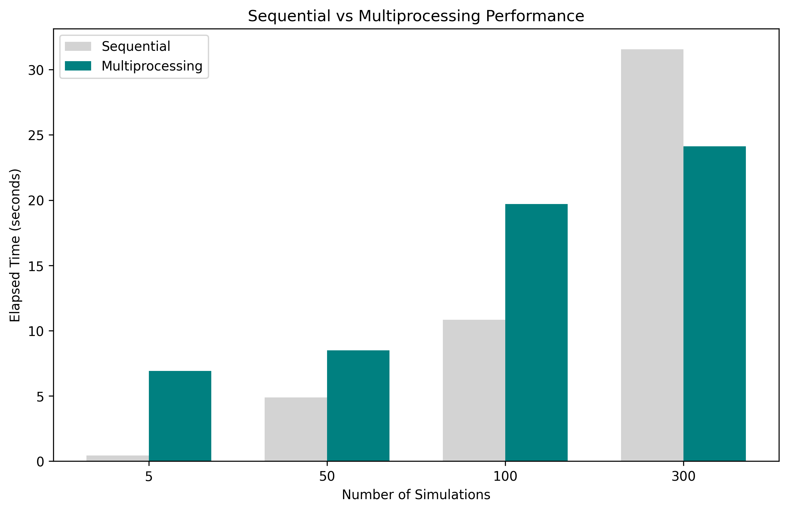

# Description

This directory contains ad-hoc scripts only.

## Running a script

To run a script use the following command:

```bash
uv run python scripts/run_multiprocess_performance_tests.py
uv run python scripts/generate_test_queue_file.py
uv run python scripts/profile_backtesting_engine.py
```

## Performance Analysis: Sequential vs. Multiprocessing Simulations

I benchmarked the runtime of the backtesting engine when running multiple simulations both sequentially (single process) and using multiprocessing.

The tests were performed with varying numbers of simulations: `5`, `50`, `100`, and `300`.

### Results Overview



**For small workloads (5 simulations):**

Sequential execution is faster. Multiprocessing introduces overhead (process creation, inter-process communication, etc.), which outweighs the benefits when the number of tasks is very small.

**For medium workloads (50–100 simulations):**

Multiprocessing begins to show clear benefits. At 100 simulations, multiprocessing runs faster than sequential execution.

**For large workloads (300 simulations):**

Multiprocessing significantly outperforms sequential execution. The sequential runtime grows much faster with scale, while multiprocessing distributes the workload across CPU cores and achieves a noticeable speedup.

### Performance Trade-offs

Multiprocessing has a **startup cost**: spinning up worker processes and managing queues is expensive relative to small task counts.

As the workload increases, this overhead becomes negligible compared to the time saved by parallel execution.

Sequential execution **scales linearly** with the number of simulations, while multiprocessing scales **sub-linearly**, showing better efficiency at higher workloads.

### Key Takeaways

- Use sequential execution for quick tests or very small workloads.
- Use multiprocessing for batch workloads (≥50 simulations), where it consistently reduces runtime.
- At large scales, multiprocessing achieves substantial performance gains — e.g., reducing the runtime for 300 simulations by **~30%** compared to sequential.
